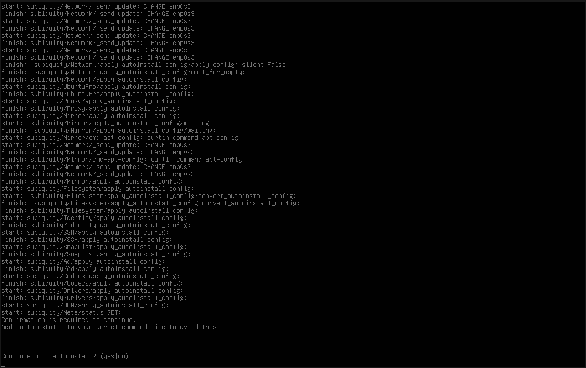
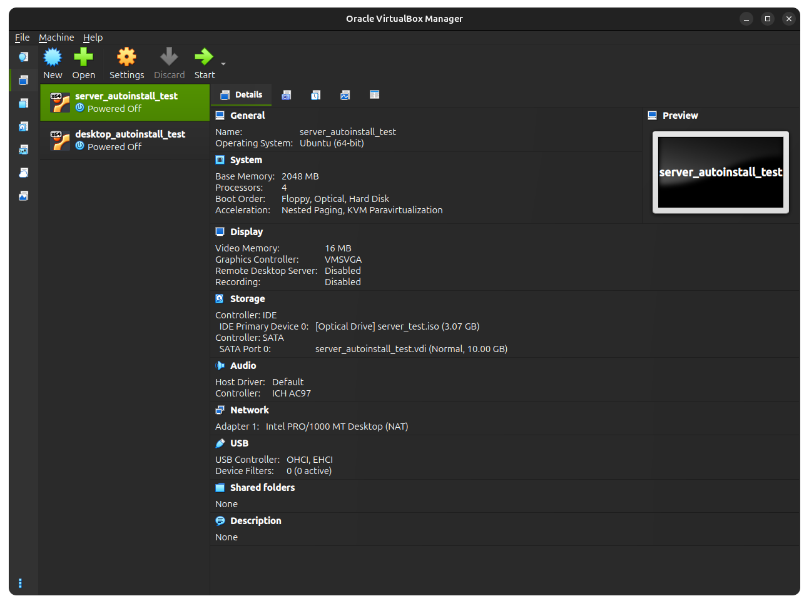
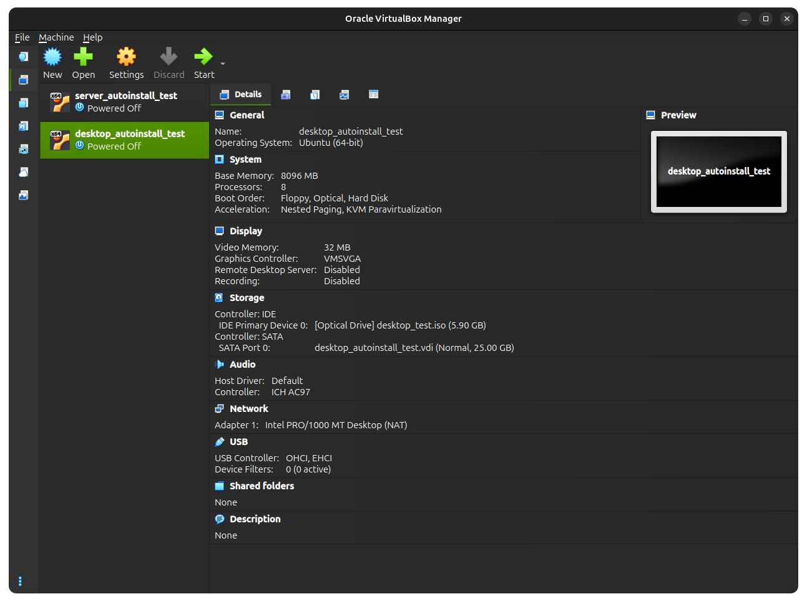

# Practical Autoinstall Example for Ubuntu Desktop

Example of functional simple and complex autoinstall.yaml files for hands-free flashing of computers with Ubuntu 24.04 Server and/or Desktop.

Shell script that can build a custom ISO image based on a standard Ubuntu Desktop/Server ISO but inserts autoinstall.yaml and optionally, modified the grub kernel command line to have completely hands-free OS installation (no user prompt at all).

## Prerequisites
To use [`ubuntu-autoinstall-iso-generator.sh`](./ubuntu-autoinstall-iso-generator.sh), ensure you have installed these prerequisite packages.

```bash
sudo apt update
sudo apt install xorriso
```

## Usage

To generate a new a custom ISO image with an `autoinstall.yaml` or cloudinit file, use the following script.

For help, run
```bash
./ubuntu-autoinstall-iso-generator.sh -h|--help
```

Example usage for basic custom ISO without modifying grub. It just puts `autoinstall.yaml` into the root dir of the ISO. When putting the ISO on a USB and attempting to install on a new computer, clicking `Try and install Ubuntu` will eventually kick off the subiquity service that will autodetect the `autoinstall.yaml` in the ISO and begin the cloud init process. The user will be prompted `yes/no` to continue the autoinstall process after a bit:
```bash
./ubuntu-autoinstall-iso-generator.sh --autoinstall ./dev_autoinstall_desktop.yml --source /path/to/downloaded/source/iso/ubuntu-24.04.3-desktop-amd64.iso --destination ./desktop_test.iso
```
For example, 
 


Example usage for completely hands-free installation, no prompting at all except initial grub menu selection (use with caution). It completely avoids the prompt from the above image by doing what the message suggests, adding "autoinstall" to the grub kernel command line. This is done internally in the script by extracting the original ISO contents then modifying `boot/grub.cfg` to include "autoinstall". The new ISO constructed with the modified grub file will no longer stop to prompt the user at all:
```bash
./ubuntu-autoinstall-iso-generator.sh --autoinstall ./dev_autoinstall_server.yml --source /path/to/downloaded/source/iso/ubuntu-24.04.3-live-server-amd64.iso --destination ./server_test.iso --unattended
```
This script is modified from here: https://github.com/covertsh/ubuntu-autoinstall-generator

I removed all the ridiculous emojis, added pythonic loguru style logging, and updated grub menu manipulation to work on Ubuntu 24.04 and (hopefully) later. I tested the resulting ISOs for Server/Desktop in VirtualBox VMs and on my personal laptop.


## Discussion/Explanation

There are numerous ways to use Ubuntu's new autoinstall/cloud-init feature each varying on levels of hands-free-ness.

TODO

## Debugging/Testing

Testing OS flashing on hardware can be a very time consuming processing, especially when trying to test system-wide configurations from a single file like the new autoinstall/cloud-init framework.

As such, debugging repeatedly virtually using virtual machines helps iterate way 
Assuming you have installation media (a USB stick) with Ubuntu Desktop 24.04 on it. Simply drop this file onto the highest level directory of the USB.

Initiate the install process on the new machine and step through the setup. When you get to the Installation page, select the `autoinstall` option and choose to boot from a file. Provide the path to the autoinstall file like so `file:///<name of autoinstall.yml>` and validate the install.

If formed properly, the entire system should be up and running in about 15 minutes with all your favorite packages and (most) settings already configured!

## Testing with VirtualBox

1. Install VirtualBox
2. If on Linux, you may encounter this error and may need to run this
    ```bash
    lsmod | grep kvm
    # Validat output and you'll probably need to run these
    sudo modprobe -r kvm_intel
    sudo modprobe -r kvm
    ```
3. See the modified `ubuntu-autoinstall-iso-generator.sh` to generate a custom ISO image with the autoinstall embedded and set that as the optical disk to boot from when testing with VirtualBox VMs.
4. 

Recommended configurations for VirtualBox Testing
 

 

Configuration for server ISO:
- CPU: 4 cores
- RAM: 2048 MB
- Storage: 10 GB


Configuration for desktop ISO:
- CPU: 8 cores
- RAM: >7000 MB (if it's too low, the process is too slow and freezes up regularly)
- Storage: 25 GB

Test on Ubuntu 24.04.3 Server AND Desktop with VirtualBox 7.2.4 

